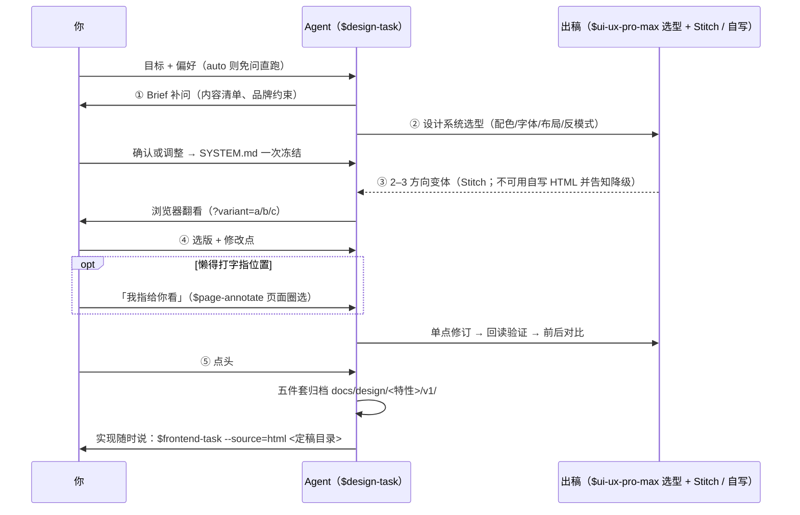

# Design Task 操作手册

`$design-task` 是专业 UI 设计 lane：你说目标，它出带设计系统的方向稿，你翻选、多轮微调，最终冻结成可交接的定稿。它只管设计，实现交给 `$frontend-task`。

- 🎨 **设计系统先行**——配色、字体、布局先定依据再出稿；系统一次冻结，所有稿共用，风格不断裂。
- 🔀 **多方向并发**——一次 2–3 个方向变体，翻选代替反复用文字描述「我想要的感觉」。
- 🔁 **微调不失控**——单点修改 + 回读验证 + 前后对比，多轮直到你满意，没有轮数上限。
- 🧊 **定稿可交接**——五件套冻结归档、版本只增不覆盖，`$frontend-task --source=html` 直接接。
- 🛡️ **兜底不卡死**——Stitch 不可用自动降级 agent 自写 HTML 并明确告知；定稿下载有刚性兜底链，每级失败自动下落。
- 📍 **指哪打哪**——修订轮懒得打字，说「我指给你看」直接在页面上圈（`$page-annotate`）。

## 1. 🎛️ 五步怎么走、谁出手



| 步骤 | 🤖 agent 做什么 | 你做什么 |
| --- | --- | --- |
| ① Brief | 问页面目标、内容清单、品牌约束（可用 [简报模板](../../.agents/skills/design-task/templates/design-brief.md) 一次填完） | 🙋 **说清目标与偏好**——一句话带情绪词 + 克制边界 + 转化目标最有效 |
| ② 设计系统 | 用 `$ui-ux-pro-max` 给**选型依据**：配色板、字体配对、布局模式、反模式清单 | ✋ **必须你确认**——这一步定了，之后所有稿共用同一系统（SYSTEM.md，一次冻结） |
| ③ 出稿 | 2–3 个方向变体（Stitch 云端生成；不可用时 agent 自写 HTML 并**明确告知降级**） | 👀 浏览器翻看（`?variant=a/b/c`） |
| ④ 翻选与修订 | 单点修改，改完回读验证，给你前后对比 | ✋ **必须你选版 + 给修改点**——可多轮；可「我指给你看」圈选 |
| ⑤ 定稿冻结 | 五件套归档 `docs/design/<特性>/vN/`，交接口径写入 | ✋ **必须你点头**——满意才冻结；确认后 `$frontend-task` 直接实现 |

**✋ 必须你出手的就三个点**：② 确认设计系统、④ 选版给修改、⑤ 点头冻结——其余围观即可；auto 模式例外（全免，事后审阅）。

**怎么进入（三种）：**

- 直接唤起：对话里说 `$design-task <目标 + 偏好>`。
- 从任务流程转入：`$frontend-task` 做无参照新页面时，agent 会问「快速方向还是专业设计？」——选**专业设计**自动进入本 lane；选**快速方向**走 `$prototype`（一次性方向确认，不进本 lane）。
- 🤖 auto 无人值守：第一句带 `auto`——全程免询问免确认（设计系统直接冻结、定稿自动走兜底链），产出标「候选定稿」；事后你审阅：满意补一句转正，不满意继续改。运行中你随时插话，即时消息优先。

判断标准：**审美要求高、要打磨多轮、要成体系的品牌感 → 本 lane；只想快点看个大概方向 → prototype。**

## 2. 🗂️ 什么时候用它、什么时候不用

| 场景 | 该用 |
| --- | --- |
| 🎨 审美要求高、多轮打磨、品牌体系 | 本 lane（`$design-task`） |
| ⚡ 快速确认一个方向 / 验证交互或状态 | `$prototype` |
| 🔧 已实现页面的间距、对齐、还原度问题 | `$frontend-task` 直修（不回本 lane） |
| 🖼️ 只想批量压图片、审规范、跑 E2E | `$tinypng-compress` / `$web-design-guidelines` / `$webapp-testing` |

## 3. 🎬 场景操作

五个场景都是**从开始到结束的完整问答流**，照抄改词就能用。

### 🎨 品牌落地页 / 营销页

审美要求高、要成体系品牌感的典型入口；走满五步，设计系统先行。

```text
👤：$design-task 给移动端电商做品牌主视觉落地页，偏好克制高级的风格
🤖：Brief 三问——页面目标（转化到下载还是购买）、内容清单（Hero/卖点/口碑/CTA）、品牌约束
👤：目标是应用下载转化；内容：Hero+三大卖点+口碑+下载 CTA；品牌主色 #0A7
🤖：② 选型依据——#0A7 主导 + 中性灰阶、Manrope + 思源黑、移动优先单列大留白；
      反模式：渐变堆叠、多重阴影。确认还是调？
👤：确认
🤖：SYSTEM.md v1 已冻结 ✓。出 3 个方向变体（约 2 分钟）…
      三版已出：docs/design/landing/prototypes.html，浏览器翻看（?variant=a/b/c）
👤：选 B；Hero 换实拍图；CTA 按钮再大一号
🤖：已修订，回读验证通过 ✓，前后对比已给
👤：可以，就这版
🤖：v1 定稿归档 ✓（五件套）
      实现随时说：$frontend-task --source=html docs/design/landing/v1/
```

### 🖥️ B 端后台（登录 / 仪表盘）

信息密度和层级是重点；Brief 阶段说清模块清单和数据优先级。

```text
👤：$design-task 给 B 端 SaaS 做登录页，品牌深蓝，要有专业感
🤖：选型依据（来自本地设计数据检索）——
       配色 #1E3A8A 深蓝 + Inter 字体，左文案右表单布局。
       确认这套系统，还是要调？
👤：字体换几何无衬线的
🤖：SYSTEM.md v1 已冻结 ✓。出 3 个方向变体（生成约 2 分钟）…
       三版已出：docs/design/login/prototypes.html，浏览器翻看（?variant=a/b/c）
👤：选 A；表单间距放宽些；错误提示移到输入框下方
🤖：已修订，回读验证通过 ✓，前后截图对比在 …
👤：就这版
🤖：v1 定稿归档 ✓（code.html / DESIGN.md / screen.png / PROMPTS.md / CONTRACT.md）
       实现随时说：$frontend-task --source=html docs/design/login/v1/
```

### 📱 移动端 H5 活动页

一句话里带上情绪词 + 克制边界 + 转化目标，agent 选型就有依据。

```text
👤：$design-task 做双 11 活动页 H5，氛围热烈但要克制，主 CTA 突出
🤖：Brief 补问——主 CTA 是抢购还是预约？优惠信息几条？
👤：主 CTA 预约抢购；优惠三条（满减/秒杀/券包）
🤖：② 选型依据——暖红 + 深金点缀的节庆板、加粗显示层级、折叠安全区适配；
      反模式：满屏红包雨、高饱和渐变。确认？
👤：红色再压暗一点，其余确认
🤖：已调并冻结 SYSTEM.md ✓；3 个变体已出，?variant=a/b/c
👤：选 C；优惠券区块改成三张卡横滑
🤖：已修订 + 回读验证 ✓；细节也可以「我指给你看」直接圈
👤：（页面上圈两处）就按圈的处理
🤖：读回 2 条已修，虚线对照已画，请再看
👤：满意，冻结
🤖：v1 五件套归档 ✓，实现说一声
```

### 🔄 已有定稿换方向（v2）

大改（配色体系 / 布局体系 / 跨页面方向）回本 lane：自动出 v2，并对账上一版的漂移记录（DRIFT）。小改别来这——直接对 `$frontend-task` 说。

```text
👤：$design-task 登录页整体换方向，v1 太素了
🤖：读取 v1 与 DRIFT——上次冻结后无漂移记录。
      Brief：这次要什么感觉？换配色体系还是布局体系？
👤：换配色，深蓝太沉，要亮而专业
🤖：② 新选型依据——亮蓝 + 白底高对比，字体沿用 Inter；
      布局沿用 v1 左右分栏（布局不变不重出稿）。确认？
👤：确认
🤖：SYSTEM.md v2 冻结 ✓；出 3 个新方向变体…
👤：选 B，冻结
🤖：v2 归档 ✓；对账 v1→v2：配色体系整体替换，布局/文案未动
```

### 🤖 无人值守（auto）

```text
👤：auto $design-task 给博客做关于页，简单大方
🤖：auto 模式——免询问免确认：Brief 按博客惯例补全（头像/简介/社链/联系方式），
      设计系统直接冻结，定稿自动走兜底链。跑完通知你
（……数分钟后）
🤖：候选定稿已归档 docs/design/about/v1/（标「未确认」）——
      选型依据与变体过程在 PROMPTS.md，浏览器看 prototypes.html
👤：看过了，满意，转正
🤖：已转正 ✓（确认状态已更新）；实现随时说
```

**修订指令的写法**（好坏差别很大）：

- ✅ 好指令 = **位置 + 改什么 + 不改什么**：「只改 Hero 主按钮：换成品牌主色；尺寸、文案、导航都不动」
- ❌ 坏指令 = 模糊形容：「让它高级一点」

**懒得打字指位置**：直接说「我指给你看」——agent 按 `$page-annotate` 打开页面，你在页面上拖框圈选问题、点「提交」，回终端说「读」，agent 读回坐标与元素诊断后逐条修改（见 [Page Annotate 操作手册](PAGE-ANNOTATE.md)）。

## 4. 📁 定稿五件套各记什么

定稿归档 `docs/design/<特性>/vN/`，**版本只增不覆盖**；迭代工作区 `.stitch/` 不入 git。

| 文件 | 记什么 | 干嘛用 |
| --- | --- | --- |
| `code.html` | 定稿完整 HTML | `$frontend-task --source=html` 的视觉事实来源 |
| `DESIGN.md` | 设计系统与决策记录 | 实现侧对照设计意图 |
| `screen.png` | 定稿截图 | 一等视觉来源；对照与审计 |
| `PROMPTS.md` | 生成提示词与确认状态 | 审计：稿子怎么来的、转正没有 |
| `CONTRACT.md` | 原型没说的待确认项 | 实现前补业务决定，不从截图瞎编业务规则 |

**定稿之后怎么续：**

| 你想要 | 走哪 | 说明 |
| --- | --- | --- |
| 实现页面 | `$frontend-task` | 定稿自动成为视觉基准（四件源之一） |
| 小改（换图标、改文案、调单点值） | 直接对 `$frontend-task` 说 | 不回本 lane；agent 会记入 DRIFT 备查 |
| 大改（换配色体系 / 布局体系 / 跨页面方向） | 回 `$design-task` | 自动出 v2，并对账上一版的漂移记录 |

## 5. 🤖 Agent 内部规则速览（你无需操心，遇到再对照）

- **编辑回读门**：每次修改后 agent 强制重读 HTML/截图/元数据比对——Stitch 偶发「返回成功但没保存」，此门防假成功。
- **迭代复验门**：自写稿每轮维护「已修复清单」，轮末复验不回退；交付前整页浏览器过（多视口/溢出/控件样式）+ impeccable detect 一轮——验收从轻从快，不做重验收全套。
- **定稿刚性兜底链**：⓪ 自动重试下载（命中即全自动）→ ① **请你手动导出**（agent 明确请求时，去 Stitch 网页点「导出→zip」，三秒）→ ② 高清截图还原（截图是一等来源，不是降级）→ ③ agent 自写定稿——每级失败自动降到下一级并明确告知，不卡死、不静默换路径。
- **候选定稿**：auto 产出或未确认先开发的定稿标「未确认」（PROMPTS.md 记来源与确认状态）；你事后一句点头即转正，不满意按第 4 节分流返工。
- **产物纪律**：迭代工作区 `.stitch/`（不入 git）；定稿 `docs/design/<特性>/vN/` 五件套，**版本只增不覆盖**；`CONTRACT.md` 标出原型没说的待确认项，不从截图瞎编业务规则。
- **兜底**：Stitch 不可用 → agent 自写 HTML 变体，继承同一 SYSTEM.md（风格不断裂），并明确告知降级发生——不会静默换路径。
