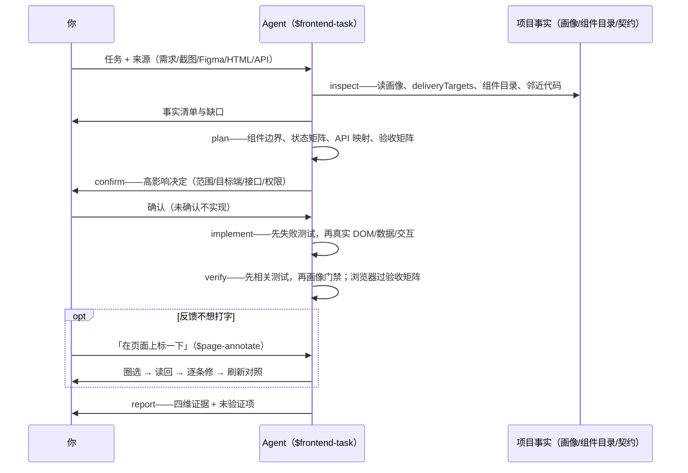

# Frontend Task 使用指南

`$frontend-task` 是从需求、截图、原型、Figma、HTML 或 API 到工程交付的主流程。

**为什么用它：**

- **先读后写**——动手前读项目画像、组件目录、接口契约和邻近代码，不凭模型记忆猜项目事实。
- **高影响先确认**——范围、目标端、视觉基线、接口/权限没拍板不实现，不先斩后奏。
- **验收有矩阵**——视口、主题、交互、键盘、无障碍、溢出、接口状态逐项过，不是「看起来好了」就算完。
- **交付带证据**——四维结果（visual / behavior / data / engineering）如实报告，没验证的项标 `unverified`，不谎报完成。
- **可恢复可审计**——中断可 `resume`；复杂任务留五件套记录，回头能查当时依据什么做的。
- **反馈指哪打哪**——验收不想打字描述位置，直接在页面上圈（`$page-annotate`）。

## 1. 六个子命令怎么配合



| 阶段 | 你需要参与吗 | 你做什么 |
| --- | --- | --- |
| `inspect` | 建议在场 | 提供来源与背景，看事实清单有没有漏 |
| `plan` | 随意 | 围观；有想法趁早说 |
| `confirm` | **必须——你拍板** | 高影响决定清单逐项等你确认；不确认不实现，agent 会停在这里等 |
| `implement` | 随意 | 可以离开，去干别的 |
| `verify` | **必须——你验收** | agent 跑完测试和验收矩阵后，你在页面上看结果；有问题说「在页面上标一下」圈出来 |
| `report` | **必须——你核对** | 四维结果、未验证项、阻塞逐项过目；你认可的才算交付 |
| `resume` | 按需 | 任务中断后喊它恢复 |

**必须你出手的就三个点**：`confirm` 拍板、`verify` 验收、`report` 核对——agent 在这三处会停下来等你，其余阶段围观或离开都行。

**六命令不是必走清单。** 上图是完整默认链，实际按任务裁剪：`confirm` 只在有高影响决定时需要；bug-fix 常走 `inspect → implement → verify → report` 短链；各命令也可单独调用（补验收、恢复中断）。中断恢复用 `$frontend-task resume --from=<stage>`，事实过期时 agent 会先带你回 `inspect`/`plan`。

## 2. 任务分类与来源

四类任务：

| 类型 | 重点 |
| --- | --- |
| `new-page` | 流程、路由、状态、接口、权限、目标端、组件 |
| `incremental` | 变化区域、保留行为、邻近回归 |
| `bug-fix` | 复现、根因、最小修复、重放 |
| `refactor` | 外部等价性；有行为/视觉变化则重新分类 |

六个来源，各自负责不同的事实域：

| 来源 | 负责的事实 | 典型形态 |
| --- | --- | --- |
| `screenshot` | 视觉基线（外观、尺寸、状态截图） | png/jpg 设计稿、竞品截图 |
| `prototype` | 行为与流程（交互怎么走） | 可点击原型、Stitch 变体 |
| `html` | 结构与样式线索 | design-task 定稿 HTML、旧页面源码 |
| `figma` | 视觉 + 版本/区域/状态绑定 | Figma 文件链接 |
| `api` | 数据与权限语义（字段、请求、状态） | 接口文档、OpenAPI |
| `requirement` | 业务意图（要什么、为什么） | 需求文档、一句话描述 |

**来源可以任意组合**，原则只有一条：每个来源独立声明自己负责的事实域，冲突时记录区域/字段后按「视觉区以更新的用户选定来源、数据与权限以 API/服务端、保留行为以现有可运行行为」裁决——不存在全局的「Figma 永远赢」或「截图永远赢」。常见两两组合示例：

| 组合 | 事实责任 |
| --- | --- |
| 截图 + 原型 | 原型负责流程，截图负责外观 |
| 截图 + API | 截图负责视觉，API 负责字段、请求和状态 |
| 原型 + API | 原型负责演示流程，API 负责真实提交语义 |
| HTML + 截图 | HTML 提供结构线索，截图提供视觉基线 |
| Figma + 截图 | 按版本、区域和状态绑定，冲突先记录 |

**页面微调反馈**：任何阶段拿到页面上看时，不想用文字描述位置就说「在页面上标一下」——`$page-annotate` 让你在页面上圈选问题，agent 读回坐标与元素诊断后逐条修（见 [Page Annotate 使用指南](PAGE-ANNOTATE.md)）。

## 3. 阶段操作

- `inspect：`确认任务类型、路由、来源版本/视口/DPR、影响模式、事实缺口、资产、组件边界和完成条件。输出事实清单与来源责任。
- `plan：`计划文件、组件复用/扩展/私有边界、状态矩阵、API 映射、权限语义、响应式和验收矩阵。复杂任务写 `docs/tasks/<task>/PLAN.md`、`STATE.json`。
- 👤 `confirm：`**需要你决策**——把高影响决定列给你逐项拍板：范围、目标端、视觉基线、路由、公共组件、接口/权限、状态、资产和验收。agent 停在这里等，未确认不实现。
- `implement：`先补针对性失败测试（项目测试栈允许时），再实现真实 DOM/UI、数据和交互。适用时覆盖 loading、empty、error、unauthorized/forbidden、disabled、success、retry、陈旧响应。截图不是背景图，mock 不是真实联调。
- `verify：`先跑改动直接相关测试，再跑项目画像质量门禁；浏览器过验收矩阵，非生产环境用真实 UI 验证主流程、失败、权限和刷新持久化。👤 **需要你验收**——agent 会把页面摆到你面前，反馈说「在页面上标一下」走 `$page-annotate` 圈选。
- 👤 `report：`**需要你核对**——报告修改文件、实际命令、路由、操作、接口/权限证据、视觉偏差、未验证项和阻塞，四维各报 `passed / failed / unverified`；你逐项过目，认可未验证项是否可接受，才算交付。
- `resume：`中断任务用 `--from=<stage>` 恢复；事实 fingerprint 过期时先回 `inspect`/`plan`。

## 4. 场景操作

六个场景都是**从开始到结束的完整问答流**。注意链长不同——不是每个任务都走满六命令，`confirm` 只在高影响决定时出现。

### 新页面

先确定流程、状态、路由、接口、权限、目标端和组件边界；无视觉参照时，快速方向走 `$prototype`，专业设计走 `$design-task`，定稿确认后实现。

```text
你：$frontend-task inspect --source=requirement --type=new-page —— 会员中心加积分明细页，需求见 docs/req.md
agent：事实清单——路由 /points 新增；需求覆盖业务事实；无视觉来源。
      缺口：目标端、视觉基线。无视觉参照：快速方向走 $prototype，专业设计走 $design-task？
你：先走专业设计（$design-task 出定稿后回来）——定稿在 docs/design/points/v1/
agent：缺口补齐，可以进入 plan
你：$frontend-task plan
agent：计划——PointsTable 复用组件目录 DataTable 扩展；状态矩阵 6 态；验收矩阵已列。
      高影响决定 3 项：目标端、接口契约、分页策略
你：$frontend-task confirm —— 桌面 + 移动 H5；接口按 docs/api.md；游标分页
agent：已锁定，开始实现
你：$frontend-task implement
agent：先补失败测试 2 个，再实现页面与接口层……完成
你：$frontend-task verify
agent：测试全绿；浏览器过矩阵：桌面 1280 ✓、H5 375 ✓、深色主题 ✓；控制台 1 条警告已修
你：$frontend-task report
agent：visual ✓ / behavior ✓ / data ✓（联调证据见 REPORT.md）/ engineering ✓；未验证项：无
```

### 截图还原（走满六命令的完整示例）

保留原始尺寸、CSS viewport、DPR、浏览器和状态，建立资产清单，实现真实 DOM，并在相同视口截图比较。

```text
你：$frontend-task inspect --source=screenshot --type=new-page —— 照 assets/login.png 还原登录页，原始视口和 DPR 别动
agent：截图事实——1440×900 @2x，Chrome；视觉基线 = 该图；资产 2 张（logo、背景）。
      缺口：无接口来源，表单提交按现有 /api/login
你：$frontend-task plan
agent：计划——LoginForm 页面私有；输入框复用 ui/Input；视口基线 1440/2x。
      高影响决定 2 项：错误提示形态（截图未覆盖）、目标端
你：$frontend-task confirm —— 就桌面 Web；错误提示用行内红字，其余按计划
agent：锁定，实现中
你：$frontend-task implement
agent：失败测试 1 个（空提交拦截）→ 实现 DOM/样式/资产 → 通过
你：$frontend-task verify
agent：矩阵通过；同视口截图对比整体一致，两处偏差——按钮圆角、输入框间距
你：在页面上标一下
agent：（页面已打开，标注器就绪）圈完点「提交」，回来说「读」
你：（圈两处，点提交）读
agent：读回 2 条——#1 登录按钮（.btn-login）；#2 密码框上间距。编号对应无误？
你：对
agent：已修，页面已刷新，上一轮标注虚线对照，请再看
你：可以了
agent：复验通过
你：$frontend-task report
agent：visual ✓（截图对比 + 标注修复证据）/ behavior ✓ / data unverified（未联调真实接口，
      mock 边界已记录）/ engineering ✓
```

### Stitch 原型

读取冻结版本的 HTML、截图、元数据、资产和 `CONTRACT.md`；`downloadUrl` 先 manual redirect + body 校验，失败时走浏览器登录态或网页端 ZIP，不把旧快照冒充新下载。

```text
你：$frontend-task --source=html docs/design/login/v1/ —— 按 v1 定稿实现登录页
agent：读取定稿五件套——code.html 视觉事实；CONTRACT.md 两项待确认：记住我默认态、错误文案
你：$frontend-task plan
agent：计划——定稿 HTML 转组件；图标按资产清单；两项契约列入 confirm
你：$frontend-task confirm —— 记住我默认不勾；错误文案用 CONTRACT.md 建议版
agent：锁定
你：$frontend-task implement
agent：实现完成，测试通过
你：$frontend-task verify
agent：验收矩阵通过；与定稿截图对比通过
你：$frontend-task report
agent：四维 ✓；实现未改定稿语义，DRIFT 无新增
```

### API 页面

先读 API 契约和现有请求层，建立字段映射与请求状态，验证 loading、empty、error、unauthorized/forbidden、disabled、success、retry 和陈旧响应。

```text
你：$frontend-task inspect --source=api --type=new-page —— 订单列表页接 /api/orders，契约在 docs/api.md
agent：API 事实——GET /api/orders 游标分页、状态枚举 5 种、401/403 语义。
      缺口：无视觉来源，布局按组件目录 DataTable 惯例（低影响，不需视觉基线确认）
你：$frontend-task plan
agent：字段映射 23 项；状态矩阵含 loading/empty/error/unauthorized/成功/陈旧。
      高影响决定 1 项：分页方式
你：$frontend-task confirm —— 游标式，其余按计划
agent：锁定
你：$frontend-task implement
agent：失败测试 3 个（空态、401 跳转、游标拼接）→ 实现 → 通过
你：$frontend-task verify
agent：非生产环境真实联调：主流程、失败、权限、刷新持久化均过
你：$frontend-task report
agent：data ✓（真实 UI 联调证据）；其余 ✓
```

### Bug fix（短链示例：低影响不设 plan/confirm）

先复现并记录实际/预期，定位根因，最小修复，重放失败和邻近正常路径。无法复现报告 `unverified`。

```text
你：$frontend-task inspect --type=bug-fix —— 提交按钮双击会重复下单
agent：复现确认——800ms 内双击出两单；根因方向：按钮无防抖 + 接口无幂等。
      影响低、修法明确，不需要独立 plan/confirm
你：$frontend-task implement
agent：复现 → 按钮禁用 + 请求幂等键 → 失败测试 → 通过
你：$frontend-task verify
agent：重放原失败 + 邻近正常路径（单击、慢网）均过
你：$frontend-task report
agent：behavior ✓（重放证据）；unverified：无
```

### Refactor（无高影响决定时 confirm 自然省略）

证明路由、行为、数据、权限、状态和视觉等价；若包含变化，改按 `incremental`。

```text
你：$frontend-task inspect --type=refactor —— UserProfile 拆展示 + 容器两层，行为视觉不能变
agent：影响模式 structure；等价面清单——路由、行为、数据、权限、状态、视觉 6 项
你：$frontend-task plan
agent：拆分计划 + 等价性验证方案（同视口截图 diff、既有测试全跑）
你：$frontend-task implement
agent：拆分完成，测试全绿，截图 diff 0 像素
你：$frontend-task verify
agent：等价面 6 项逐项核对通过
你：$frontend-task report
agent：engineering ✓（等价证据）；其余无变化
```

## 5. 任务记录：五件套各记什么

复杂、视觉、多轮或可恢复任务按需创建 `docs/tasks/<task>/`：

| 文件 | 记什么 | 干嘛用 |
| --- | --- | --- |
| `PLAN.md` | 计划：组件边界、状态矩阵、API 映射、验收矩阵 | plan 阶段产出，implement 照它做 |
| `STATE.json` | 任务状态机（阶段、事实指纹） | resume 判断从哪恢复、事实是否过期 |
| `PROMPTS.md` | 关键提示词与来源留痕 | 审计：当时依据什么做的 |
| `ACCEPTANCE.md` | 验收清单与结果 | verify / report 的对稿依据 |
| `REPORT.md` | 交付证据：四维结果、命令、未验证项 | 交付存档，回头查证 |

简单任务不建空记录（bug-fix 短链通常只需要 `REPORT.md`，甚至不建目录）。

## 6. Agent 侧规则速览（你无需操心，遇到再对照）

- `inspect` 前持续读取：`AGENTS.md`、项目画像（含支持端与运行环境）、`deliveryTargets`、组件目录、前端任务规则；只加载与来源匹配的 reference。
- 目标端缺失、冲突或 `deferred` 时不猜，转 `$project-profile update`，无任务级绕过。
- 来源是证据不是事实：采纳、排除、存疑都要记录理由；生成代码和 AI 建议只是实现参考。
- 纪律：截图不是背景图；mock 不是真实联调；HTTP 200 不等于业务成功；无法复现的缺陷报 `unverified` 不算完成。
