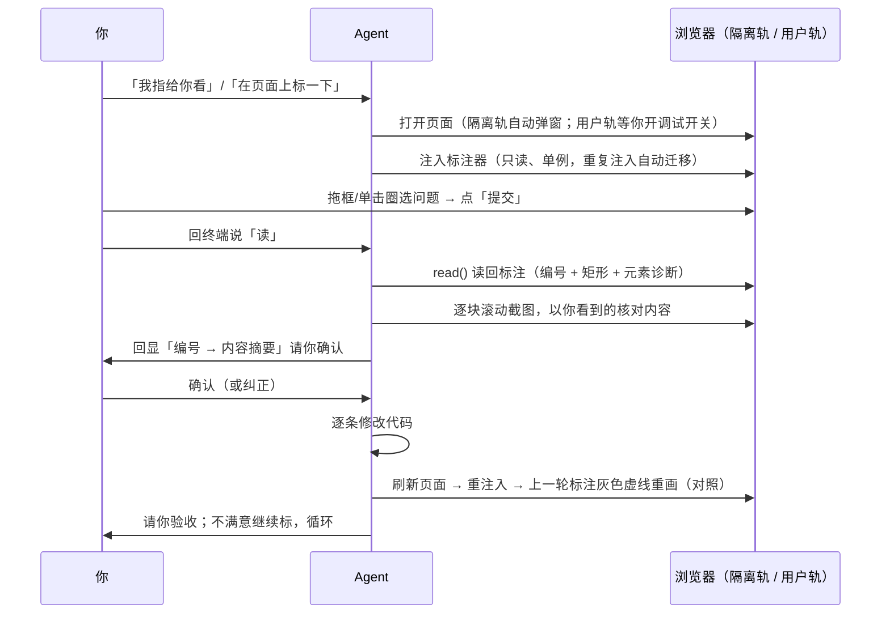

# Page Annotate 操作手册

`$page-annotate` 是页面标注反馈通道（「指哪打哪」）：页面上的问题，你直接在页面上圈出来；agent 读回每块的坐标和元素清单，逐条修。

- 📍 **所见即所指**——在页面上圈出来，免去「右侧那个按钮再往下一点」式文字描述。
- 🔬 **结构化读回**——每条标注读回编号 + 坐标 + 元素诊断（选择器、文本、字号字重、颜色），agent 不靠猜。
- 🔄 **修复轮对照**——改完代码刷新后，上一轮标注自动以灰色虚线重画，新旧对照验收。
- 🛡️ **只读安全**——标注器是只读 DOM 装饰：不改页面行为、不发送数据；用户轨 = 真实身份，agent 只读不写。
- 🚫 **fail-loud**——用户轨开关没开就明确报错提醒你去开，绝不静默换轨或自启浏览器。
- 🖱️ **30 秒上手**——拖框、单击、Alt+滚轮爬梯，没有学习成本。

## 1. 🎛️ 全链路怎么走、谁出手



| 环节 | 🤖 agent 做什么 | 你做什么 |
| --- | --- | --- |
| 唤起 | 收到「在页面上圈一下」类话锋即进入 | 随时说——任意时刻 / design-task 修订轮「我指给你看」/ frontend-task 验收轮「在页面上标一下」 |
| 开窗 | 隔离轨自动弹独立 Chrome 窗口；用户轨等你开调试开关 | 🙋 用户轨先做 §2 四步（隔离轨零配置） |
| 标注 | 注入只读标注器，就绪后等 | ✋ **圈选问题点「提交」**——操作见 §3 |
| 读回 | `read()` 读编号 + 坐标 + 元素诊断；逐块截图核对；回显「编号→摘要」 | ✋ **确认编号与内容对应**（或纠正） |
| 修复 | 逐条修改代码 | 💤 等着 |
| 对照验收 | 刷新 + 重注入，上一轮标注虚线重画 | ✋ **验收**——不满意继续标，循环到满意 |

**✋ 必须你出手的就三个点**：标注、确认编号、验收——用户轨另加开头四步开关；其余环节 agent 管。

## 2. 🖥️ 双轨与用户轨四步

| 轨 | 谁的窗口 | 前置条件 |
| --- | --- | --- |
| 隔离轨（默认） | agent 自动弹一个独立 Chrome 窗口，打开原型 / dev 页面 | 零配置，直接标 |
| 用户轨 | **你自己正开着的 Chrome**（内网系统、已登录页） | 见下方四步 |

**用户轨开启四步**（只需一次浏览器内操作，不改任何配置）：Chrome 地址栏打开 `chrome://inspect/#remote-debugging` → 打开页面开关 → 首次连接时浏览器弹「允许调试连接」点允许 → 用完回同一页面关掉开关。开关没开时 agent 会明确报错提醒你去开——**绝不静默换轨或自启浏览器**，防止你以为在真实页、实际在隔离窗口。

## 3. 🖱️ 标注操作（30 秒学会）

- 🖱️ **圈选**：拖拽画自由矩形；吸附开（默认）时悬停出布局框，单击直接标整个框。
- 🪜 **爬梯**：悬停时 `Alt+滚轮` 上/下选父/子元素框（普通滚轮仍是页面滚动）。
- 📦 **嵌套**：已标区域内单击 = 新增子区域标注，原标注保留，连点逐层加深。
- ❌ **删除**：悬停标注右上角 ✕，或 `Delete`/`Backspace` 删悬停标注；撤销/清空兜底。**单击/双击永不删除**。
- ⎋ **取消**：`Esc` 丢弃拖拽中的框。
- ✅ **提交**：点「提交」锁定本批，回终端说「读」；还想继续标就不提交。
- 🔢 编号创建时定终身；被读过的标号在页面上变淡但保留作上下文；刷新后归零。

## 4. 🎬 场景操作（照抄就能用）

### 🎨 场景 A：design-task 修订轮（隔离轨）

```text
🤖：三版已出，浏览器翻看（?variant=a/b/c）
👤：选 A，别的问题我指给你看
🤖：（打开变体页，标注器就绪）标完点「提交」，回来说「读」
👤：（页面上圈：主按钮一个框、副标题一个框，点提交）
👤：读
🤖：读回 2 条——#1 主按钮（.btn-hero，48px 圆角）…；#2 副标题（h2.subtle）…。编号对应无误？
👤：对
🤖：逐条修完，页面已刷新，上一轮标注以灰色虚线重画对照，请再看
```

### ✅ 场景 B：frontend-task 验收轮（隔离轨 / dev 页）

```text
🤖：登录页实现完成，进入验收
👤：整体可以，有两个小问题，在页面上标一下
🤖：（dev server 页面已开，标注器就绪）
👤：（圈：输入框间距一个框、错误提示位置一个框，点提交）读
🤖：#1 密码框上间距 12px→16px；#2 错误提示移到输入框下方。修复中…
🤖：已修完并刷新，虚线对照已画，请验收
```

### 🔒 场景 C：真实登录页 / 内网系统（用户轨）

```text
👤：内网审批页样式乱了，就在我自己 Chrome 里开着，在页面上圈一下
🤖：用户轨需要先开调试口：chrome://inspect/#remote-debugging 打开开关，
      连入时浏览器会弹「允许调试连接」，点允许
👤：（开开关 → 点允许）
🤖：已连上你的 Chrome（只读，不改动页面），标注吧
👤：（圈问题区域，点提交）读
```

### 🧲 场景 D：搬运样式 / 存参考（显式引用提取协议）

> 扩展用法：引用[页面样式提取协议](../rules/AI_PAGE_EXTRACT.md)后，圈选的不只是问题——可以整块搬走。协议细节（提取产物、落点、红线）都在那份文档里，这里只演示怎么开口。

**copy——照着外网系统做进开发页：**

```text
👤：把 XX 后台这块表格区搬到我开发中的 /list 页，按页面样式提取协议来
🤖：源页在用户轨——chrome://inspect/#remote-debugging 打开开关，登录后导航到目标页
👤：（开开关 → 登录 → 导航到那页）
🤖：（连入你的 Chrome，只读；标注器就绪）圈完点「提交」，回来说「读」
👤：（圈表格区，点提交）读
🤖：标准包已提取落盘（截图+结构+样式）；转 frontend-task 在 /list 实现……
🤖：开发页同区域截图已与源图并排对照（docs/design/compare/list/），请拍板
👤：间距不对，再改改
🤖：（按已落盘证据迭代，不再打扰外部系统）改完新对照图已出，请再看
```

**save——这页好看，存下来：**

```text
👤：这个侧边栏好看，存下来给以后的页面用，按页面样式提取协议
🤖：（同上捕获提取）条目已落 docs/design/references/xx-admin-侧边栏/
      （多状态截图+结构+样式+功能规格摘要），日后做页面可直接引用作视觉依据
```

## 5. 🔬 内部机制速览（agent 做了什么）

- **注入即用**：标注器是一段只读 DOM 装饰脚本，注入目标页即生效——不改变页面行为、不发送数据；单例设计，重复注入自动销毁旧实例并迁移未读标注。
- **读回的是结构化数据**：每条标注 = 终身编号 + 矩形坐标 + 元素诊断（选择器、文本、字号字重、颜色、盒子），锚定元素的标注随 resize/滚动自动重画。
- **防误判两道闸**：逐块截图以「你看到的」核对元素清单；编号摘要回显请你确认后才派活。
- **修复轮对照**：改完代码刷新重注入后，上一轮标注自动以灰色虚线重画，新旧对照验收；「提交」自动清除对照。
- 刷新由 agent 管：改码 → 刷新 → 重注入 → 请你验收；你手动刷新清掉标注器也无妨，agent 发现后重新注入。

## 6. 🚧 边界

- 只解决**静态视觉反馈**；流程/交互态问题（点击后跳转错等）仍走文字描述。
- `auto` 模式、CI、subagent 会话**不触发也不阻塞**——那些场景 agent 用自己的验收通道（验收矩阵、快照断言、impeccable、`$webapp-testing`）。
- 用户轨 = 你的真实身份：agent 在真实页面只读不写，写操作必须你明示。
- 桌面鼠标交互；触屏不支持。
