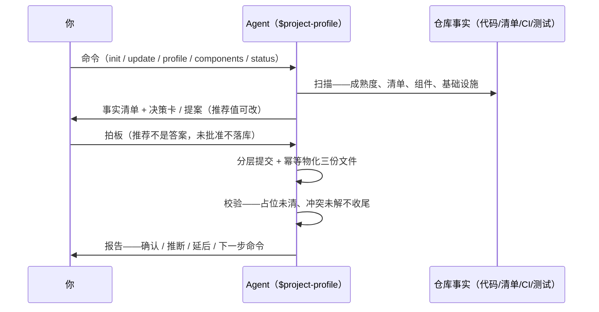

# Project Profile 操作手册

`$project-profile` 是项目画像与组件目录的建档维护通道：仓库能查到的它自己查证，只有决定问你；推荐给你看，批准前不落库。

- 📖 **能查到的不问你**——仓库证据 agent 自己查证填写，只把工具查不到的决定拿来问你，不拿敷衍问题浪费你时间。
- ✋ **高影响先确认**——框架、构建命令、源码目录、契约、权限、验收标准没拍板不落库，不先斩后奏。
- 🗂️ **建议不是答案**——每项推荐带来源、置信度和可改备选；展示过不等于写过，批准才落库。
- 🧩 **两域分治**——画像和组件目录各有专管命令，共享一次成熟度评估，互不越界代填。
- ⏸️ **延后有账**——暂不能定的字段记理由、影响和跟进条件，不糊弄成完成。
- 🔁 **幂等可恢复**——重复运行不覆盖已确认值；提案中断可续；`status` 随时指出下一步。

## 1. 🎛️ 六个命令：怎么配合、谁出手



| 命令 | 🤖 agent 做什么 | 你做什么 |
| --- | --- | --- |
| `$project-profile` | 只读导航：讲清五个命令各管什么，不暗中启动任何流程 | 🙋 选好入口再来 |
| `init` | 新项目专用：一次扫描、七张决策卡、生成可编辑提案、分层落库、原子物化三份文件；检出存量代码立即停手转 `update` | ✋ **必须拍板**——逐卡确认，提案任意字段可改 |
| `profile` | 画像域面谈：成熟度评估、模板选择、全量占位清点、`$grill-me` 分组提问、幂等落库校验 | ✋ **必须回答**——只答决定，事实它自己查 |
| `components` | 组件域面谈：先从代码提取实际组件与边界，矩阵占位逐项归类 | ✋ **必须裁决**——成员、命名、边界、合并 |
| `status` | 只读：报告成熟度、两域状态、占位、延后、冲突和下一步建议命令 | 👀 看 |
| `update` | 重扫代码与配置；无歧义低影响事实直接记录；变化与未解决字段按「画像 → 组件」顺序分流面谈 | ✋ 裁决变化与冲突；已确认值它不动 |

**✋ 必须你出手的就三个点**：`init` 的决策卡与提案批准、两域面谈的回答、`update` 的冲突裁决——agent 在这三处会停下来等你，其余扫描、查证、落库、校验围观或离开都行。

**链路按场景裁剪，六命令不是必走清单：**

- 新项目：`init` 一条走完（扫描 → 决策卡 → 提案 → 批准 → 物化 → 校验）。
- 存量项目首次建档：`init` 检出 existing 停手 → `update` 分流面谈。
- 日常维护：`update` 重扫分流，或单域直接 `profile` / `components`。
- 只看不动：`status` 一次报全部状态。
- 面谈随时可断可续：延后项存 `unresolved`（理由 + 影响 + 跟进条件），提案可 resume，批准后归档进 state。

## 2. 🗂️ 两域、成熟度与事实分级

两域各管一份文件，谁先到谁做共享的成熟度评估并持久化，后到的不重评：

| 域 | 专管文件 | 管什么 |
| --- | --- | --- |
| 画像（`profile`） | `docs/PROJECT_PROFILE.md` | 目标端、技术栈、事实源、命令、权限、验收参数 |
| 组件（`components`） | `docs/rules/AI_COMPONENT_CATALOG.md` | 组件清单、复用矩阵、页面决策、planning/implemented 标注 |

成熟度三态决定入口走向（综合业务源码、清单、脚本、基础设施、测试、CI 判定，不走文件数捷径）：

| 成熟度 | 判据 | 走向 |
| --- | --- | --- |
| `unformed` | 空仓或早期代码，无稳定约定 | `init`：generic / react / vue 三模板全展示，讲清推荐等你选或延后 |
| `existing` | 业务源码、可运行入口、稳定约定 | `init` 停手转 `update`：从现有代码建档（推荐），或显式模板迁移（先看影响、冲突、回滚条件） |
| `uncertain` | 证据矛盾 | 带证据与置信度报告，不硬选 |

事实三源，地位不同：

| 源 | 地位 | 谁出手 |
| --- | --- | --- |
| 仓库证据 | 事实 | agent 查证填写，不来问你 |
| 你的显式决定 | 事实（最高优先） | 只问工具查不到的决定 |
| 模板值 | 候选 | 展示推荐与理由，批准前不落库 |

裁决原则只有一条：**事实与默认严格分离**——仓库证据和你的决定是事实，模板值只是候选；已确认字段永不因推断被覆盖；低影响事实（如检测到的包管理器）也要进面谈归类，不许因「无所谓」漏记。

📍 **面谈入口**：两域面谈统一走 `$grill-me`（协议本体 grilling）——相关字段分组提问提高可读，但覆盖到的字段逐一点名，不含糊带过。

## 3. 🎬 场景操作

六个场景都是**从开始到结束的完整问答流**。链长不同——`status` 一轮就完，建档面谈要多轮，`init` 从卡片到物化一条走完。

### 🆕 新项目建档（`init` 完整链）

一次扫描、七张决策卡（目标端、产品形态、框架、视觉基线、移动交互、数据/安全、验收）、可编辑提案、分层落库、原子物化。

```text
👤：$project-profile init —— 新仓库刚建，还没写代码
🤖：成熟度 unformed（无业务源码、无清单）。七张决策卡：目标端推荐浏览器 Web + 移动 H5 + 平板响应式；
      产品形态、框架、视觉基线、移动交互、数据/安全、验收各有推荐默认
👤：目标端和验收按推荐；框架 Vue 3；数据这块先按无后端
🤖：提案已建 .toolkit/profile-proposal.json——每项含推荐值、来源、置信度、影响字段、可改备选；
      字段级追溯矩阵如下，批准前任意卡可改
👤：视觉基线改成 Tailwind，其余照准
🤖：依赖推荐已重算并重新展示；分层落库：仓库事实 → 你的决定 → 已批准推荐 → 组件规划 → 延后项
🤖：PROJECT_PROFILE.md / AI_COMPONENT_CATALOG.md / profile-state.json 已原子物化，校验通过；
      被否值按 deferred 留了理由与跟进条件
```

### 🏠 存量项目首次建档（`init` 停手转 `update`）

存量代码不走 `init`——它检出即停不迁移，转 `update` 分流两域面谈。

```text
👤：$project-profile init —— 两年的 Vue 后台要建档
🤖：成熟度 existing（业务源码 + 可运行入口 + 稳定约定）；init 是新项目专用，检出即停——转 update
👤：$project-profile update
🤖：重扫完成：无歧义低影响事实 12 项已直接记录；画像域 5 个字段变化/未定，进面谈；组件域随后
🤖：（画像面谈 $grill-me）支持端从路由与构建产物看是 Web + H5，已按证据填；这两项要你定——
      模板从现有代码生成还是显式迁移、维护信息归属
👤：从现有代码生成；维护信息归我
🤖：画像域收尾：占位全部归类；转组件域——从代码提取了 41 个组件与边界，矩阵占位进面谈
```

### 🔄 日常更新（`update`）

重扫后只直接记录无歧义低影响事实；变化与冲突分流面谈，已确认值（如模板选择）永不被静默改写。

```text
👤：$project-profile update —— 构建工具从 webpack 换成 vite 了
🤖：重扫：构建命令变化（低影响，已按证据更新）；模板选择是你确认过的，不动；
      组件域 2 行矩阵与代码不一致，进面谈
👤：（组件面谈）那两行按代码为准
🤖：报告：变化 3 / 保留决定 1 / 冲突 0 / 延后 0；校验通过
```

### 📊 只看状态（`status` 最短链）

只读不动文件，报告两域状态和下一步建议。

```text
👤：$project-profile status
🤖：成熟度 existing（置信度高）；画像 initialized、模板 vue；组件目录 drafting——占位 3、延后 1；
      下一步建议：$project-profile components
```

### 🧩 单域修补（直接 `components`）

只动组件目录：从代码提取实际组件，不拿模板示例替换真实组件。

```text
👤：$project-profile components —— 新写了 6 个业务组件没进目录
🤖：成熟度评估已在（两域共享，不重评）；从代码提取 6 个组件与边界；
      2 处边界不确定——保留 / 合并 / 扩展 / 延后？
👤：两套 DataTable 合并成一套，其余按提取结果
🤖：占位全部归类；componentCatalogStatus → initialized（无占位、无冲突才置）
```

### ⏸️ 延后与恢复

延后不是丢弃：记理由、影响、跟进条件；依赖该项的字段暂停，独立的继续问。

```text
👤：（面谈中）目标端这事我得问老板，先放着
🤖：已记 unresolved——理由、影响、跟进条件各就位；独立字段继续问，依赖它的两个字段暂停
👤：$project-profile profile —— 老板定了，Web + 移动 H5
🤖：该字段已确认入档；被暂停的两个依赖字段恢复提问……收尾：占位全部归类，校验通过
```

## 4. 📁 产出文件：各记什么

| 文件 | 记什么 | 干嘛用 |
| --- | --- | --- |
| `docs/PROJECT_PROFILE.md` | 项目画像：目标端、技术栈、事实源、命令、权限、验收参数、兼容裁决记录（只追加） | 所有任务的先读事实源 |
| `docs/rules/AI_COMPONENT_CATALOG.md` | 组件目录：清单、复用矩阵、页面决策、planning/implemented 标注 | 复用与边界依据，页面任务必读 |
| `.toolkit/profile-state.json` | 状态机：成熟度、两域状态、unresolved、提案归档 | `status` / `update` / resume 的依据 |
| `.toolkit/profile-proposal.json` | `init` 提案：决定、推荐值、来源、置信度、影响、备选 | 批准前可编辑的工作稿；批准后归档进 state |

提案只有 `init` 会建；日常维护直接面谈落库，不留中间稿。

## 5. 🤖 Agent 侧规则速览（你无需操心，遇到再对照）

- 内部阶段 `inspect` / `plan` / `confirm` / `apply` / `migrate` / `validate` 供编排器使用，日常无需知晓。
- 改文件前先读 references：state-model、template-selection、update-policy。
- 分层提交：仓库事实 / 用户决定 / 已批准推荐 / 已批准组件规划 / 延后项——展示过不等于写过。
- 兼容裁决记录只追加不重置；`update` 复查靠它跳过已裁决且未变的条目。
- 纪律：推荐不是答案；总结不是完成标准——占位未分类不收尾；已确认字段不因推断被覆盖；组件目录有占位或冲突时状态不能是 `initialized`。
- 确认门：框架、构建命令、源码目录、API 契约、身份、权限、生成物归属、验收标准、模板迁移、组件库选择、公共组件边界——动了就要你拍板。
